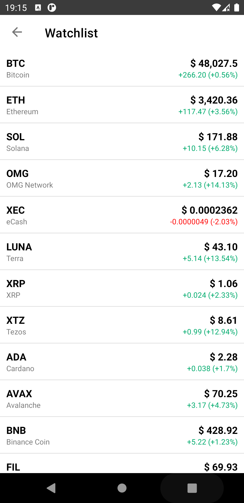
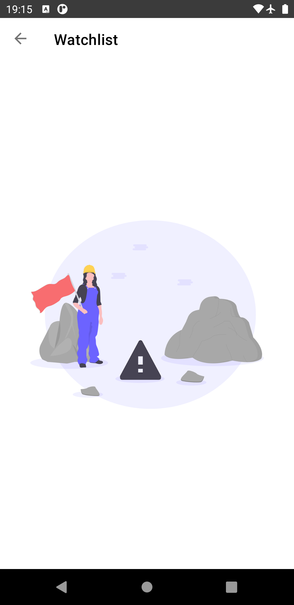
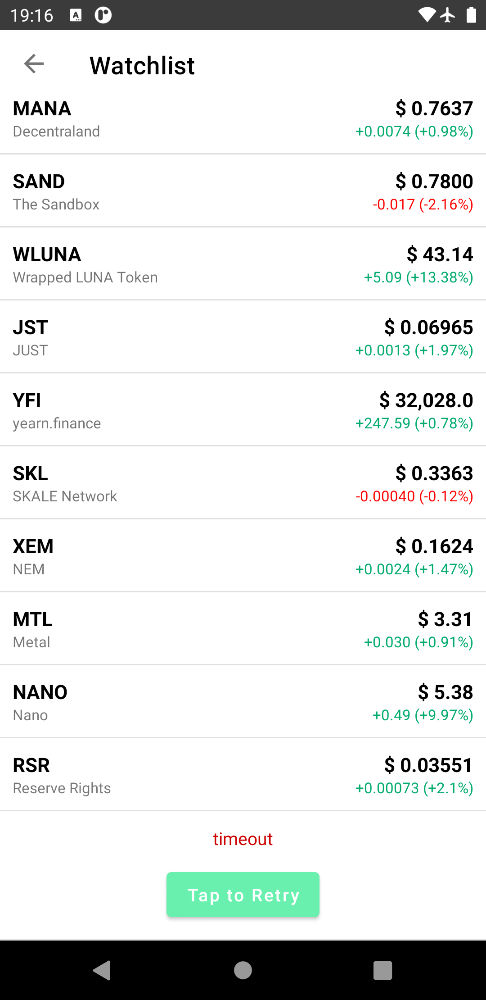

<h1 align="center">
Stockbit Test
</h1>
Ini adalah projek online test dari Stockbit dengan membuat dua tampilan, yaitu Halaman Login dan Halaman Watchlist. 
 - Halaman Login berisi tampilan sesuai dengan UI Login pada aplikasi Stockbit.
 - Halaman Watchlist berisi tampilan data crypto yang diambil melalui REST API dan ditampilkan setiap 50 data setiap scroll.

## Screenshots

  
  
  
  
  
  

## Features
- [x] Toggle hide/show password
- [x] Display data from REST API every 50 data
- [x] Handling loading and error state when first request 
- [x] Pagination every 50 data
- [x] Handling loading and error state below recycler view using LoadStateAdadpter from Paging 3 Library.
- [x] Handling orientation change without request data again.

## Tech Stack
- [x] View Binding
- [x] Navigation Component
- [x] Paging 3
- [x] MVVM
- [x] Koin Dependency Injection

## Author
| [ <b>Alvin Tandiardi</b>](https://github.com/alvintan05)  |
| :-----------------------------------------------------------------------------------------------------------------------------------------------------------------: |
